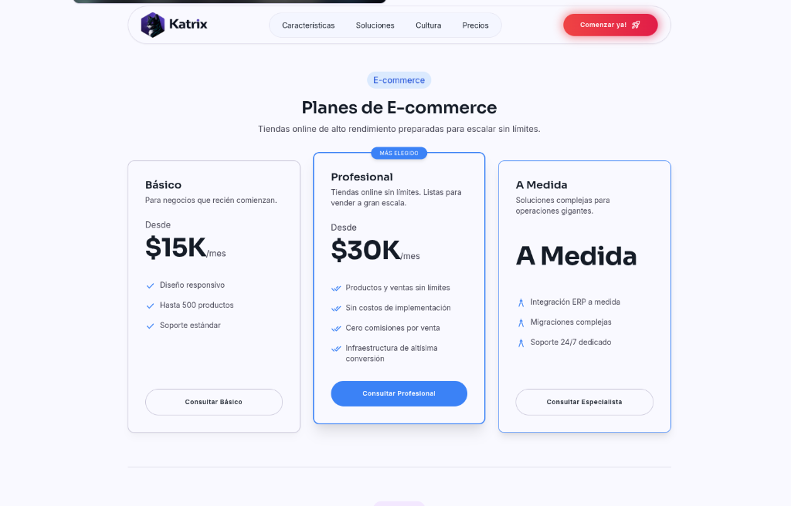

# Katrix Landing Page 🚀

Plataforma de presentación corporativa (Landing Page) para **Katrix**, una agencia especializada en E-commerce de alto rendimiento, Infraestructura a medida e Inteligencia Artificial (RAG).


---

## 🌟 Características Principales

*   **Diseño Enterprise-Grade:** UI/UX moderna enfocada en la conversión, utilizando Glassmorphism, gradientes atractivos y micro-interacciones.
*   **Single Page Application (SPA):** Navegación fluida y sin recargas simulando un enrutamiento complejo gracias al Control Flow de Angular 17.
*   **Segmentación de Precios Estratégica:**
    *   Planes de **E-commerce** (Básico, Profesional, A Medida).
    *   Planes de **Inteligencia Artificial (RAG)** (Básico, Profesional, A Medida).
*   **Formulario Inteligente (AJAX):**
    *   Integrado con **FormSubmit** para enviar correos directamente sin backend.
    *   Pre-selección automática del servicio de interés basado en el plan seleccionado por el usuario.
    *   Validación y feedback visual en pantalla (sin redirecciones).
*   **Páginas Legales y de Estado integradas:** Política de Privacidad, Términos de Servicio, Seguridad y Status del Sistema accesibles de forma instantánea.
*   **SEO Optimizado:** Configurado en español para maximizar la visibilidad orgánica.

---

## 💻 Tecnologías Utilizadas (Tech Stack)

*   **Framework:** [Angular 17+](https://angular.dev/) (Standalone Components, Signals, Control Flow `@if`)
*   **Estilos:** [Tailwind CSS](https://tailwindcss.com/)
*   **Iconografía:** Google Material Symbols
*   **Envío de Formularios:** [FormSubmit](https://formsubmit.co/) (AJAX API)

---

## 📸 Pantallas (Screenshots)

Aquí tienes la estructura visual de la aplicación:

### 1. Sección de Precios y Servicios


### 2. Formulario de Contacto Dinámico
 <!-- Reemplazar con screenshot real -->

### 3. Estado del Sistema
 <!-- Reemplazar con screenshot real -->

---

## ⚙️ Instalación y Uso Local

Sigue estos pasos para levantar el proyecto en tu entorno local:

1. **Clonar el repositorio:**
   ```bash
   git clone <tu-repositorio>
   cd katrix-landing
   ```

2. **Instalar dependencias:**
   ```bash
   npm install
   ```

3. **Ejecutar servidor de desarrollo:**
   ```bash
   npm run start
   ```
   *El proyecto estará disponible en `http://localhost:4200/`*

4. **Compilar para producción:**
   ```bash
   npm run build
   ```
   *Los archivos optimizados se generarán en la carpeta `dist/` listos para ser desplegados en Vercel, Netlify o cualquier servidor estático.*

---

## 📧 Configuración del Formulario (FormSubmit)

El formulario de contacto está configurado para enviar correos a `consultas@mail.katrix.com.ar`.

**Nota importante para el despliegue:**
La primera vez que se envía un formulario desde una URL nueva, FormSubmit enviará un correo de **Activación** a esa dirección. Es obligatorio hacer clic en el botón de activación de dicho correo para comenzar a recibir los mensajes de los clientes.

---

**Desarrollado con ❤️ por el equipo de Katrix.**
